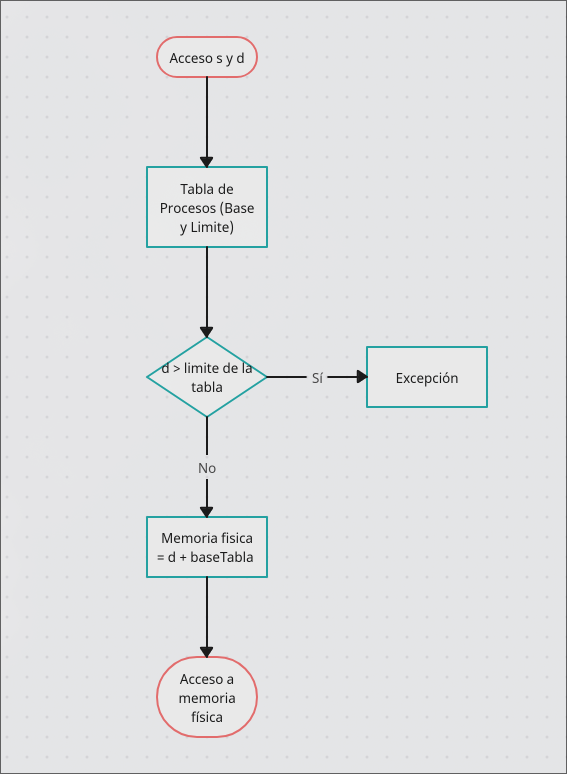

# Administración de memoria
## Política y Filosofía
### Fragmentación Interna
La fragmentación interna ocurre cuando los bloques de memoria asignados son mayores a los requeridos, por lo que el almacenamiento guarda memoria no utilizable o inútil (a no ser que el usuario los requiera para una función específica).

__Importancia en el rendimiento:__ Este tipo de fragmentación puede ocasionar que procesos que requieren un espacio mayor en memoria no puedan utilizar, realientizadolos y equivaliendo a tiempos de espera más largos. (Aunque hemos realizado unos programas en Java que se pueden considerar simples y poco eficientes, en el desarrollo de programas implementados de manera profesional es peligroso caer en este tipo de fragmentación, en especial en el desarrollo de Sistemas Operativos Complejos o peor aún, con un espacio de memoria muy reducido o Sistemas Operativos Embebidos). 

### Fragmentación Externa
Este tipo de fragmentación ocurre cuando el disco duro contiene suficiente memoria, pero esta contiene pequeños bloques de memoria dispersos alrededor del disco, quedando como pequeños "restos" e impidiendo la creación de bloques de memoria más grandes o utilizables. 

__Importancia en el rendimiento:__ Este tipo de fragmentación me parece la más importante a cosiderar dentro de un sistema operativo, yya que puede afectar en mayor medida el rendimiento al ser memoria dispersa que tarda más en eliminarse y la desfragmentación, a veces, tiene que hacerse manualmente por el usuario (y, personalmente, he tenido que desfragmentar varios discos duros viejos o utilizados con grandes cantidades de memoria, lo que ha aumentado el rendimiento de los equipos en mayor medida.)

## Politicas de reemplazo de pagínas en un Sistema Operativo
Estas politicas son algoritmos que se encargan de gestionar la memroia virtual dentro de un sistema operativo. 
Cuando un proceso necesita una página que no está en la memoria principal, el sistema operativo debe decidir qué página sacar de la memoria para hacer espacio a la nueva página.

### FIFO (First In - First Out)
Este se encarga de reemplazar la pagina que más tiempo ha permanecido en memoria, conforme vayan llegando, van saliendo. 
Su ventaja principal es que es facil de implementar, y su principal desventja es que al agregar más marcos de memoria puede aumentar el número de fallos en la página. 

### LRU (Least Recently Used)
Este se encarga de reemplzara la pagina que no ha sido utilizada por el periodo de tiempo en memoria más largo. 
Su principal ventaja es que se basa en el principio de localidad temporal, lo que lo vuelve más eficiente en muchas cargas de trabajo al mismo tiempo. 
Lo cual tambien es su principal desventaja, ya que puede resultar costoso realizar el seguimiento de multiples paginas. 

### LFU (Least Frequently Used)
Este hace lo contrario y se necarga de registrar la pagina con un menor numero de frecuencia y reemplazarla. 
Su ventaja es que puede resultar beneficiosa para páginas que son utilizadas con mayor frecuencia a lo largo del tiempo. 
Aunque su desventaja es que es dificil de adaptar a diferentes cambios repentinos en el patrón de acceso. 

### Clock (Second Chance)
Este es muy semejante al FIFO, ya que se necraga de mantener un bit de la página en memoria en caso de que la pagina haya sido referenciada. 
Su principal ventaja que es más eficiente que el FIFO y más facil de implementar que el LRU, al mantener un pequeño espacio de memoria, es mucho más facil de localizar las páginas referenciadas.
Aunque su desvenataj es que es más innexacta que el LRU solamente. 

### NRU (Not Recently Used)
Este se encarga de priorizar las páginas menos utilizadas en base a dos bits de referencia por página.
Su principal ventaja es que simpplifica bastante el criterio de selección de páginas a reemplazar, aunque puede ser menos precios que el LRU. 

### Optimal (OPT)
Este se encarga de reemplazar la página que será menos utilizada en el futuro, en base a suposiciones en el tiempo de uso registrados en memoria. 
Este garantiza el menor número de fallos posibles en la página, pero es impractico porque requiere poner ver el futuro (aún no llegamos tan lejos para utiizarlo, pero sería en mi opinión, el más práctico). 

Por lo tanto, considerando las definiciones encontradas, considero que el LRU es el más eficiente al tratarse del más exacto al momemto de localizar páginas a reemplazar.

## Memoria Real
__Programa en C encargado de simular espacio en disco duro__

~~~
#include <stdio.h>
#include <time.h> 
#include <stdlib.h>
typedef struct Proceso
{
    int valor;
    int memoria;
}Proceso;
typedef struct Particion
{
    int tamano;
    Proceso proceso;
}Particion;
void añadir(Particion DISK[]);
void liberar(Particion DISK[]);
void mostrar(Particion DISK[]);
int capacidad;
int particiones;
int main(){ 
    printf("Ingrese el tamaño total de memoria en KB: ");
    scanf("%d", &capacidad);
    printf("Ingrese el número de particiones: ");
    scanf("%d", &particiones);
    Particion DISK[particiones];
    for (size_t i = 0; i < particiones; i++)
    {
        int capacidadI;
        printf("Ingrese la cantidad de la partición %d: ", (i+1));
        scanf("%d", &capacidadI);
        if(capacidadI > capacidad){
            printf("NO PIDAS TANTO ESPACIO.\n");
            i--;
        } else {
            Particion p;
            Proceso pp;
            pp.valor = 0;
            p.tamano = capacidadI;
            p.proceso = pp;
            DISK[i] = p;
        }
    }
    int decision = 99;
    while(decision!=4){
        printf(" Selecciona una opción: \n 1.Crear proceso. \n 2.Liberar espacio \n 3.Mostrar espacios de memoria \n 4.Salir\n");
        scanf("%d", &decision);
        switch (decision)
        {
        case 1:
            añadir(DISK);
            break;
        case 2: 
            liberar(DISK);
            break;
        case 3:
            mostrar(DISK);
            break;
        case 4:
        printf("Un gusto!");
            break;
        }
    }
    return 0;
}

void añadir(Particion DISK[]){
    int id_proceso;
    int tamañoP;
    printf("Ingrese el ID del proceso: ");
    scanf("%d", &id_proceso);
    printf("Ingrese el tamaño del proceso: ");
    scanf("%d", &tamañoP);
    if(tamañoP<capacidad){
        for (size_t i = 0; i < particiones; i++)
        {
            if(tamañoP<DISK[i].tamano && DISK[i].proceso.valor==0){
                Proceso p;
                p.memoria = tamañoP;
                p.valor = id_proceso;
                DISK[i].proceso = p;
                printf("Proceso No. %d asignado a Particion %d\n", id_proceso, (i+1));
                break;
            } else {
                printf("Sin espacios de memoria listos en la partición %d\n", (i+1));
            }
        }
    } else {
        printf("El proceso exige más memoria de la disponible :(\n"));
    }
}
void liberar(Particion DISK[]){
    int procesoB;
    printf("Seleccione el proceso a liberar: ");
    scanf("%d", &procesoB);
    for (size_t i = 0; i < particiones; i++)
    {
        if(DISK[i].proceso.valor == procesoB){
            DISK[i].proceso.valor = 0;
            printf("Proceso %d liberado", procesoB);
            break;
        }
    }
}
void mostrar(Particion DISK[]){
    for (size_t i = 0; i < particiones; i++)
    {
        if(DISK[i].proceso.valor == 0){
            printf("Partición %d vacia\n", (i+1));
        } else {
            printf("Particion %d con proceso %d con espacio de %d KB\n", (i+1), DISK[i].proceso.valor, DISK[i].proceso.memoria);
        }
    }
}
~~~

__Programa con el algoritmo de "primera cabida"__

~~~
#include <stdio.h>
#include <stdbool.h>

#define MAX_PARTICIONES 10
#define MAX_PROCESOS 10

typedef struct {
    int tamano;
    bool libre;
} Particion;

typedef struct {
    int id;
    int tamano;
    bool asignado;
    int particionAsignada;
} Proceso;

void mostrarResultados(Proceso procesos[], int numProcesos, Particion particiones[], int numParticiones) {
    printf("\nResultados de la asignación:\n");
    printf("Proceso\tTamaño\tPartición asignada\n");
    for (int i = 0; i < numProcesos; i++) {
        if (procesos[i].asignado) {
            printf("%d\t%d\t%d\n", procesos[i].id, procesos[i].tamano, procesos[i].particionAsignada + 1);
        } else {
            printf("%d\t%d\tNo asignado\n", procesos[i].id, procesos[i].tamano);
        }
    }

    printf("\nEstado final de las particiones:\n");
    printf("Partición\tTamaño\tEstado\n");
    for (int i = 0; i < numParticiones; i++) {
        printf("%d\t\t%d\t%s\n", i + 1, particiones[i].tamano, particiones[i].libre ? "Libre" : "Ocupada");
    }
}

void primeraCabida(Particion particiones[], int numParticiones, Proceso procesos[], int numProcesos) {
    for (int i = 0; i < numProcesos; i++) {
        procesos[i].asignado = false;
        for (int j = 0; j < numParticiones; j++) {
            if (particiones[j].libre && particiones[j].tamano >= procesos[i].tamano) {
                procesos[i].asignado = true;
                procesos[i].particionAsignada = j;
                particiones[j].libre = false;
                break;
            }
        }
    }
}

int main() {
    int numParticiones, numProcesos;

    printf("Introduce el número de particiones: ");
    scanf("%d", &numParticiones);

    Particion particiones[MAX_PARTICIONES];
    for (int i = 0; i < numParticiones; i++) {
        printf("Introduce el tamaño de la partición %d: ", i + 1);
        scanf("%d", &particiones[i].tamano);
        particiones[i].libre = true;
    }

    printf("Introduce el número de procesos: ");
    scanf("%d", &numProcesos);

    Proceso procesos[MAX_PROCESOS];
    for (int i = 0; i < numProcesos; i++) {
        procesos[i].id = i + 1;
        printf("Introduce el tamaño del proceso %d: ", i + 1);
        scanf("%d", &procesos[i].tamano);
    }

    primeraCabida(particiones, numParticiones, procesos, numProcesos);

    mostrarResultados(procesos, numProcesos, particiones, numParticiones);

}
~~~

## Organización de Memoria Virtual
__Paginación__ La paginación consiste en dividir la memoria virtual en unos bloques de memoria de estado fijo llamados "páginas", y la memoria fisica en unos espacios de memoria llamados "bloques". Cuando un proceso requiere acceder a un espacio de memoria, la dirección virtual asignada se traduce a una tabla de páginas, que se encarga de mapear cada oágina diferente a un espacio físico de memoria. 

__¿En que consiste el proceso de páginación?__ 
#### División de páginas
Estos espacios de memoria se dividen en espacios pequeños de memoria (este espacio depende del sistema operativo que se este utilizando, por ejemplo, 4KB por página). 
#### Tabla de páginas
Cada proceso tiene una tabla de páginas que se encarga de mapear cada espacio de memoria virtual a un espacio de memoria física. 
#### Acceso a memoria
Como cada proceso necesita acceder a un espacio de memoria (ya sea tato virtual como física) es necesario que el CPU utilice su tabla de páginas correspondiente para obtener su propia dirección de memoria física. 

#### Proceso de Page Default
Si la página del proceso se encuentra solicitada, a esta se le asigna una tabla default, en la cual el disco duro debe cargar una página desde un espacio predeterminado de memoria física. 

### Principales ventajas de la paginación
Entre las principales ventajas de la páginación se encuentran: 

1. Debido al tamaño "personalizado" de las páginas, no produce una fragmentación externa en el disco duro. 
2. Las páginas pueden ser reubicadas en espacios de memoria de manera facil, aumentando la eficiencia entre la carga de procesos. 
3. Ocurre una especie de "encapsulamiento" en el cual un porceso cueta con su propio espacio de memoria, evitando que un proceso externo acceda al espacio de memoria de otro proceso. 
4. Cada proceso de mayor tamaño puede ser cargado facilmente en memoria. 

### Principales desvetajas de la páginación
1. No ocurre framentación externa, pero si fragmentación interna. Esto ocurre en el caso que el tamaño de la tabla de páginas no sea de un múltiplo exacto a una tabla de páginas preestablecida. (Ya que a pesar de que cada proceso tiene su propia tabla de páginas, todas tienen un tamaño personalizado) . 
2. Al final, si se tiene una gran cantidad de procesos, la carga de tablas de páginas en memoria puede llegar a ser importante para el usuario o significativa (esto especialmente si el Sistema Operativo es del tipo Embebido, en el cual el espacio de memoria y el acceso a los dispositivos y hardware es limitado). 
3. El buscar entre las tablas de memoria puede llevar a una latencia adicional, lo que se traduce en mayores tiempos de carga (que en un sistema que requiera un tiempo muy exacto, como diferentes programas de Física, puede llegar a ser un porcentaje de tiempo significativo). 

__Segmentación__ La segmentación se encarga de dividir los espacio de memoria en direcciones de segmentos lógicos (codigo, pilas, etc). Por lo que cada proceso puede llegar a tener un tamaño de memoria personalizado dependiendo de las necesidades del proceso, por lo que los segmentos de memoria no se encuentran obligados a ser del mismo tamaño. 

__¿En que consiste el proceso de páginación?__
#### División de segmentos
Al igual que en la páginación (pero esta vez, en el proceso) la memoria se divide en los segmentos de código personalizados. 
#### Tabla de segmentos
Ahora, en lugar de tener una tabla de páginas, se guarda en memoria una tabla de segmentos, que se encargan de mapear cada uno en una dirección de memoria física. 
#### Acceso a memoria
Cuando el CPU necesita acceder a un proceso en especifico, utiliza en esta ocasión la tabla de segmentos para acceder al proceso correspondiente. 

### Ventajas
1. Al tratarse de una manera mucho más facil de manejar los espacios de memoria, es mucho más facil el manejo de cada proceso. 
2. Al tratarse de tamaños personalizados, ocurre menos fragmentación interna dentro del disco duro. 
3. Los segmentos son capaces de personalizarse a las necesidades de cada proceso (por lo que po ejemplo, una pila puede aumentar de tamaño si así es requerido). 

---
## Administración de Memoria Virtual 
__Programa LRU__
~~~
#include <stdio.h>
#include <limits.h>

void imprimirEstado(int frames[], int numFrames) {
    printf("Memoria: ");
    for (int i = 0; i < numFrames; i++) {
        if (frames[i] == -1) {
            printf("[ ] ");
        } else {
            printf("[%d] ", frames[i]);
        }
    }
    printf("\n");
}

int buscarEnMemoria(int frames[], int numFrames, int pagina) {
    for (int i = 0; i < numFrames; i++) {
        if (frames[i] == pagina) {
            return i;
        }
    }
    return -1;
}

int encontrarLRU(int tiempos[], int numFrames) {
    int lruIndex = 0;
    int minTiempo = tiempos[0];
    for (int i = 1; i < numFrames; i++) {
        if (tiempos[i] < minTiempo) {
            minTiempo = tiempos[i];
            lruIndex = i;
        }
    }
    return lruIndex;
}

void lru(int paginas[], int numPaginas, int numFrames) {
    int frames[numFrames];
    int tiempos[numFrames];
    int fallosDePagina = 0;

    for (int i = 0; i < numFrames; i++) {
        frames[i] = -1; // Indica que el marco está vacío
        tiempos[i] = 0;
    }

    for (int t = 0; t < numPaginas; t++) {
        int paginaActual = paginas[t];
        printf("\nAccediendo a página: %d\n", paginaActual);

        int indice = buscarEnMemoria(frames, numFrames, paginaActual);

        if (indice != -1) {
            tiempos[indice] = t;
            printf("Página %d ya está en memoria.\n", paginaActual);
        } else {
            fallosDePagina++;
            int posicionReemplazar;

            if (buscarEnMemoria(frames, numFrames, -1) != -1) {
                posicionReemplazar = buscarEnMemoria(frames, numFrames, -1);
            } else {
                posicionReemplazar = encontrarLRU(tiempos, numFrames);
                printf("Reemplazando página %d con página %d.\n", frames[posicionReemplazar], paginaActual);
            }

            frames[posicionReemplazar] = paginaActual;
            tiempos[posicionReemplazar] = t;
        }

        imprimirEstado(frames, numFrames);
    }

    printf("\nTotal de fallos de página: %d\n", fallosDePagina);
}

int main() {
    int numPaginas, numFrames;

    printf("Introduce el número de páginas: ");
    scanf("%d", &numPaginas);
    int paginas[numPaginas];
    for (int i = 0; i < numPaginas; i++) {
        printf("Introduce la página %d: ", i + 1);
        scanf("%d", &paginas[i]);
    }

    printf("Introduce el número de marcos de página: ");
    scanf("%d", &numFrames);

    lru(paginas, numPaginas, numFrames);

    return 0;
}
~~~

## Diagrama explicando la localización de memoria física a través de memoria virtual. 

## Integración
__Análisis de administración de Memoria Virtual en mi S.O (Fedora)__ 

Fedora utiliza un sistema de paginación para almacenar los procesos en memoria virtual (normalmente un espacio de 4KB por página). Esta información se almacena en pequeños bloques de páginas virtuales en la memoria RAM según se requiera, y las páginas que no se requieran de manera inmediata se almacenan en el SWAP o memoria de intercambio del sistema. Cada proceso tiene su propia paginación virtual, lo que permite el aislamient y seguridad entre procesos. Además, cuenta con un proceso en segundo plano llamado kswapd (tambien llamado el demonio de intercambio 😈), este se encarga de monitorear el uso de la memoria y el SWAP. 

__Programa de simulación de la memoria SWAP__
~~~
#include <stdio.h>
#include <stdlib.h>
#include <string.h>

typedef struct {
    int pid;   
    int size;  
} Process;

typedef struct {
    int total_memory;  
    int used_memory;   
    Process *physical_memory[10]; 
    Process *swap_space[10];      
    int swap_count;               
    int physical_count;           
} Memory;

void init_memory(Memory *memory, int total_memory) {
    memory->total_memory = total_memory;
    memory->used_memory = 0;
    memory->swap_count = 0;
    memory->physical_count = 0;
    memset(memory->physical_memory, 0, sizeof(memory->physical_memory));
    memset(memory->swap_space, 0, sizeof(memory->swap_space));
}

void add_process(Memory *memory, Process *process) {
    if (memory->used_memory + process->size <= memory->total_memory) {
        memory->physical_memory[memory->physical_count++] = process;
        memory->used_memory += process->size;
        printf("Proceso %d agregado a memoria física (tamaño: %d).\n", process->pid, process->size);
    } else {
        memory->swap_space[memory->swap_count++] = process;
        printf("Proceso %d movido al espacio de swap (tamaño: %d).\n", process->pid, process->size);
    }
}

void remove_process(Memory *memory, int pid) {
    for (int i = 0; i < memory->physical_count; i++) {
        if (memory->physical_memory[i]->pid == pid) {
            printf("Proceso %d eliminado de memoria física.\n", pid);
            memory->used_memory -= memory->physical_memory[i]->size;
            for (int j = i; j < memory->physical_count - 1; j++) {
                memory->physical_memory[j] = memory->physical_memory[j + 1];
            }
            memory->physical_memory[--memory->physical_count] = NULL;
            return;
        }
    }
    printf("Proceso %d no encontrado en memoria física.\n", pid);
}
void move_from_swap(Memory *memory) {
    if (memory->swap_count == 0) {
        printf("No hay procesos en el swap.\n");
        return;
    }
    Process *process = memory->swap_space[0];
    if (memory->used_memory + process->size <= memory->total_memory) {
        // Mover a memoria física
        add_process(memory, process);
        // Reorganizar el swap
        for (int i = 0; i < memory->swap_count - 1; i++) {
            memory->swap_space[i] = memory->swap_space[i + 1];
        }
        memory->swap_space[--memory->swap_count] = NULL;
    } else {
        printf("No hay suficiente espacio en memoria física para mover el proceso %d.\n", process->pid);
    }
}
void show_status(Memory *memory) {
    printf("\nEstado de la memoria:\n");
    printf("Memoria física usada: %d/%d\n", memory->used_memory, memory->total_memory);
    printf("Procesos en memoria física:\n");
    for (int i = 0; i < memory->physical_count; i++) {
        printf("  PID: %d, Tamaño: %d\n", memory->physical_memory[i]->pid, memory->physical_memory[i]->size);
    }
    printf("Procesos en swap:\n");
    for (int i = 0; i < memory->swap_count; i++) {
        printf("  PID: %d, Tamaño: %d\n", memory->swap_space[i]->pid, memory->swap_space[i]->size);
    }
    printf("----------------------------------------\n");
}
int main() {
    Memory memory;
    init_memory(&memory, 100); // Inicializar la memoria con 100 unidades
    Process p1 = {1, 40};
    Process p2 = {2, 30};
    Process p3 = {3, 50};
    Process p4 = {4, 20};
    add_process(&memory, &p1);
    add_process(&memory, &p2);
    add_process(&memory, &p3);
    add_process(&memory, &p4);
    show_status(&memory);
    remove_process(&memory, 1);
    move_from_swap(&memory);
    show_status(&memory);

    return 0;
}

~~~

## Administración de Enttrada y Salida (E/S)
### Dispositivos de Bloque y Caracter
__Dispositivos de Bloque__ 
Estos son bloques que llegan a contener información, comúmnente de 512 bites o múltiplos de este. Estos son mucho más rapidos en identificar los bloques de memoria, ya que se encargan de optimizar la transferencia de datos, por lo que se utilizan en dispositivos de almacenamiento masivo, como servidores, o sin alejarnos tanto, discos duros o memorias USB. 

__Dispositivos de Carácter__
Estos se encargan de guardar memoria de manera secuencial (byte por byte), por lo que no permiten el acceso aleatorio de memoria. Estos suelen ser más lentos que los tipo bloque porque registran la memoria por cada byte, por lo que son más utilizados en dispositivos de E/S como un teclado o impresora, los cuales no admiten un registro de memoria mayor del necesario, especialmente el teclado que requiere solamente un carácter (o varios si se trata de una combinación de teclas, pero sigue siendo menor que el almacenamiento de un disco duro). 

__Manejador de dispositivos en C__
~~~
class VirtualInputDevice:
    def __init__(self, name="VirtualDevice", device_type="keyboard"):
        self.name = name
        self.device_type = device_type
        self.connected = False
        self.input_buffer = []

    def connect(self):
        if not self.connected:
            self.connected = True
            print(f"[INFO] {self.name} conectado.")
        else:
            print(f"[WARNING] {self.name} ya está conectado.")

    def disconnect(self):
        if self.connected:
            self.connected = False
            print(f"[INFO] {self.name} desconectado.")
        else:
            print(f"[WARNING] {self.name} ya está desconectado.")

    def send_input(self, data):
        if self.connected:
            self.input_buffer.append(data)
            print(f"[INPUT] {data} recibido por {self.name}.")
        else:
            print(f"[ERROR] {self.name} no está conectado.")

    def read_input(self):
        if self.connected and self.input_buffer:
            data = self.input_buffer.pop(0)
            print(f"[READ] {data} procesado.")
            return data
        elif not self.connected:
            print(f"[ERROR] {self.name} no está conectado.")
        else:
            print(f"[INFO] No hay datos en el buffer.")
            return None

class DeviceManager:
    def __init__(self):
        self.devices = {}

    def register_device(self, device_name, device_type="keyboard"):
        if device_name not in self.devices:
            self.devices[device_name] = VirtualInputDevice(device_name, device_type)
            print(f"[INFO] Dispositivo {device_name} registrado como {device_type}.")
        else:
            print(f"[WARNING] {device_name} ya está registrado.")

    def unregister_device(self, device_name):
        if device_name in self.devices:
            del self.devices[device_name]
            print(f"[INFO] {device_name} eliminado del registro.")
        else:
            print(f"[ERROR] {device_name} no está registrado.")

    def list_devices(self):
        print("[INFO] Dispositivos registrados:")
        for device_name, device in self.devices.items():
            status = "Conectado" if device.connected else "Desconectado"
            print(f" - {device_name} ({device.device_type}) - {status}")

# Simulación
if __name__ == "__main__":
    manager = DeviceManager()

    # Registrar y conectar un dispositivo virtual
    manager.register_device("TecladoVirtual", "keyboard")
    manager.register_device("MouseVirtual", "mouse")

    manager.list_devices()

    teclado = manager.devices.get("TecladoVirtual")
    teclado.connect()
    teclado.send_input("Hola, mundo")
    teclado.send_input("Otra entrada")
    teclado.read_input()
    teclado.read_input()
    teclado.read_input()

    manager.list_devices()
    teclado.disconnect()
    manager.unregister_device("TecladoVirtual")
    manager.list_devices()

~~~

__Pseudocódigo de como el S.O detecta las interrupciones de E/S__
~~~
estadoProcesador = ejecutandoTarea;
interrupcionesProcesador = true;

funcion_de_interrupcion(){
    guardarContexto(estadoProcesador);
    datoEntrada = leerTecla();
    procesarEvento(datoEntrada);
    restaurarContexto(estadoProcesador);
}

funcion ejecutar(){
    mientras(true){
        si(interrupcionesProcesador){
            estadoProcesador = Esperando;
            esperarE/S();
        }
        si(interrupcion==true){
            interrupcionE/S();
        }
    }
}

funcionMain(){
    ejecutar();
}
~~~

__Manejo básico de interrupciones en un sistema simulado__
~~~
import time
import threading
class InterruptHandler:
    def __init__(self):
        self.interrupts = {}  # Diccionario para registrar los manejadores

    def register_interrupt(self, interrupt_type, handler):
        self.interrupts[interrupt_type] = handler

    def handle_interrupt(self, interrupt_type, *args, **kwargs):
        if interrupt_type in self.interrupts:
            print(f"Interrupción detectada: {interrupt_type}")
            self.interrupts[interrupt_type](*args, **kwargs)
        else:
            print(f"Interrupción no manejada: {interrupt_type}")

def keyboard_interrupt(key):
    print(f"Se presionó la tecla: {key}")

def timer_interrupt():
    print("Temporizador activado.")

def main():
    interrupt_handler = InterruptHandler()

    
    interrupt_handler.register_interrupt("keyboard", keyboard_interrupt)
    interrupt_handler.register_interrupt("timer", timer_interrupt)

    
    def simulate_keyboard_interrupt():
        while True:
            key = input("Presiona una tecla (q para salir): ")
            if key == "q":
                break
            interrupt_handler.handle_interrupt("keyboard", key)

    def simulate_timer_interrupt():
        while True:
            time.sleep(5)  # Temporizador de 5 segundos
            interrupt_handler.handle_interrupt("timer")

    
    keyboard_thread = threading.Thread(target=simulate_keyboard_interrupt)
    timer_thread = threading.Thread(target=simulate_timer_interrupt, daemon=True)

    keyboard_thread.start()
    timer_thread.start()

    keyboard_thread.join()

if __name__ == "__main__":
    main()
~~~

### Estructuras de Datos para el manejo de dispositivos (Cola de Procesos)
Una cola de interrupciones de E/S es un tipo de estructura de datos que se utiliza para gestionar de manera ordenada las diferentes solicitudes de Entrada y Salida que los procesos se encargan de hacer a los diferentes dispositivos periféricos, como son el hardware completo de la computadora. 
Como una estructura de datos del tipo Cola, cuenta con las caracteristicas de ese tipo de estructura, entre las cuales se encuentran: 
1. Posee una estructura FIFO (First In - First Out), en el cual el primer elemento que entra a la cola es el primero que sale (a menos de que se les asigne una prioridad, en tal caso, se debe hacer la selección a partir de la posición del proceso con mayor prioridad). 
2. Utiliza diferentes algoritmos como SCAN o C-LOOK en los cuales se encarga de optimizar la planificación de los procesos. 
3. Comúmnete los procesos en este tipo de colas se bloquean hasta que el CPU les permite el acceso o hace una llamada a estos procesos. 
4. 

__Código para una cola con prioridad__
~~~
#include <stdio.h>
#include <stdlib.h>
#include <time.h>

typedef struct _nodo { //Crea un tipo de dato abstracto
    int valor;
    int prioridad;
    struct _nodo *siguiente; //Sirve como un puntero a si mismo 
} nodo;

int numero_aleatorio() {
    return (rand() % 4) + 1;
}

nodo* genera_proceso() { //regresa direcciones del tipo nodo
    static int contador = 1; //ese dato se mantiene estatico con el fin de contar el número del proceso  
    nodo* nuevo = (nodo*)malloc(sizeof(nodo)); //el malloc se encarga de sacar la direccion de memoria, a un tipo de puntero de un nodo llamado nuevo.   
    if (nuevo == NULL) {
        printf("Error al asignar memoria.\n"); //Ups, se acabo la memoria. 
        exit(1);
    }
    nuevo->valor = contador++; //El operador flecha sirve para acceder a atributos de un espacio de memoria.
    nuevo->prioridad = numero_aleatorio();
    nuevo->siguiente = NULL; 
    return nuevo;
}

void insertar_final(nodo** cabeza) {  //mandar la direccion del primer puntero
    nodo* nuevoNodo = genera_proceso();
    if (*cabeza == NULL) {
        *cabeza = nuevoNodo;
    } else {
        nodo* temp = *cabeza;
        while (temp->siguiente != NULL) {
            temp = temp->siguiente;
        }
        temp->siguiente = nuevoNodo;
    }
}
void imprimir_lista(nodo* cabeza) {
    nodo* temp = cabeza;
    while (temp != NULL) {
        printf("|Proceso %p| (Prioridad %p)|direc %p| -> ", temp->valor, temp->prioridad, temp->siguiente);
        temp = temp->siguiente;
    }
    printf("NULL\n");
}

void atender_prioridad(nodo** cabeza) {
    if (*cabeza == NULL) {
        printf("No hay procesos para atender.\n");
        return;
    }
    nodo* temp = *cabeza;
    nodo* maxNodo = temp;
    nodo* maxNodoPrevio = NULL;
    nodo* previo = NULL;
    // Buscar el nodo con la prioridad más alta
    
    // Atender el nodo con prioridad más alta
    printf("Atendiendo proceso %d", temp->valor);
    // Eliminar el nodo de la lista
    *cabeza = temp;
    free(temp);
}

int main() {
    srand(time(NULL));
    nodo* cabeza = NULL;
    int op = 0;

    do {
        printf("1. Genera proceso\n");
        printf("2. Atiende proceso\n");
        printf("3. Mostrar Lista de Procesos\n");
        printf("4. Salir\n");
        printf("Seleccione una opción: ");
        scanf("%d", &op);

        switch (op) {
            case 1:
                insertar_final(&cabeza);
                break;
            case 2:
                atender_prioridad(&cabeza);
                break;
            case 3:
                imprimir_lista(cabeza);
                break;
            case 4:
                printf("Saliendo...\n");
                break;
            default:
                printf("Opción no válida\n");
        }
    } while (op != 4);

    return 0;
}
~~~

__Manejador de dispositivos a través de una tabla de estructuras__
~~~
#include <stdio.h>
#include <string.h>
typedef struct {
    char nombre[20];
    int estado;               
    void (*leer)(void);       
    void (*escribir)(void);  
} Dispositivo;

void leer_dispositivo(void) {
    printf("Leyendo del dispositivo...\n");
}

void escribir_dispositivo(void) {
    printf("Escribiendo en el dispositivo...\n");
}

int abrir_dispositivo(Dispositivo *tabla, int n, const char *nombre) {
    for (int i = 0; i < n; i++) {
        if (strcmp(tabla[i].nombre, nombre) == 0) {
            if (tabla[i].estado == 1) {
                printf("El dispositivo '%s' ya está abierto.\n", nombre);
                return -1;
            }
            tabla[i].estado = 1;
            printf("Dispositivo '%s' abierto.\n", nombre);
            return 0;
        }
    }
    printf("Dispositivo '%s' no encontrado.\n", nombre);
    return -1;
}

int cerrar_dispositivo(Dispositivo *tabla, int n, const char *nombre) {
    for (int i = 0; i < n; i++) {
        if (strcmp(tabla[i].nombre, nombre) == 0) {
            if (tabla[i].estado == 0) {
                printf("El dispositivo '%s' ya está cerrado.\n", nombre);
                return -1;
            }
            tabla[i].estado = 0;
            printf("Dispositivo '%s' cerrado.\n", nombre);
            return 0;
        }
    }
    printf("Dispositivo '%s' no encontrado.\n", nombre);
    return -1;
}

int main() {
    Dispositivo tabla[] = {
        {"DiscoDuro", 0, leer_dispositivo, escribir_dispositivo},
        {"Impresora", 0, leer_dispositivo, escribir_dispositivo},
        {"Teclado", 0, leer_dispositivo, escribir_dispositivo}
    };
    int n = sizeof(tabla) / sizeof(Dispositivo);
    abrir_dispositivo(tabla, n, "DiscoDuro");
    abrir_dispositivo(tabla, n, "Teclado");

    printf("Operación de lectura:\n");
    tabla[0].leer();  // Leer del DiscoDuro

    printf("Operación de escritura:\n");
    tabla[1].escribir();  // Escribir en el Teclado

    cerrar_dispositivo(tabla, n, "Teclado");
    cerrar_dispositivo(tabla, n, "DiscoDuro");

    return 0;
}

~~~
__Flujo de proceso de lectura de un disco magnetico__
~~~
import os

def leer_archivo(ruta_archivo):
    print("1. Iniciando proceso de lectura.")
    if not os.path.exists(ruta_archivo):
        print("2. Error: El archivo no se encuentra en el disco.")
        return
    
    print("2. Archivo encontrado. Ubicando en el disco...")
    
    print("3. Accediendo a sectores del disco...")
    try:
        with open(ruta_archivo, 'r') as archivo:
            print("4. Transfiriendo datos a la memoria principal...")
            contenido = archivo.read()
            print("5. Lectura completa. Mostrando datos:\n")
            print(contenido)
    except Exception as e:
        print("Error durante la lectura del archivo:", e)

    print("6. Fin del proceso.")
ruta = "archivo_prueba.txt"
leer_archivo(ruta)
~~~

__Operaciones de E/S asincronas utilizando archivos__

~~~
#include <stdio.h>
#include <stdlib.h>
#include <string.h>
#include <aio.h>
#include <errno.h>
#include <unistd.h>

#define BUFFER_SIZE 1024

void manejar_error(const char *mensaje) {
    perror(mensaje);
    exit(EXIT_FAILURE);
}

void esperar_operacion(struct aiocb *aio_op) {
    while (aio_error(aio_op) == EINPROGRESS) {
        // Esperar a que la operación asíncrona finalice
        usleep(1000);  // Pequeño retraso para evitar consumir CPU
    }
}

int main() {
    const char *archivo = "archivo_asincrono.txt";
    const char *mensaje_escritura = "Este es un ejemplo de E/S asíncrona en C.\n";

    char buffer_lectura[BUFFER_SIZE];
    memset(buffer_lectura, 0, BUFFER_SIZE);

    struct aiocb aio_escritura;
    memset(&aio_escritura, 0, sizeof(struct aiocb));
    aio_escritura.aio_fildes = open(archivo, O_WRONLY | O_CREAT | O_TRUNC, 0644);
    if (aio_escritura.aio_fildes == -1) manejar_error("Error al abrir archivo para escritura");

    aio_escritura.aio_buf = mensaje_escritura;
    aio_escritura.aio_nbytes = strlen(mensaje_escritura);
    aio_escritura.aio_offset = 0;

    
    if (aio_write(&aio_escritura) == -1) manejar_error("Error en aio_write");

    printf("Escritura asíncrona iniciada...\n");

    
    esperar_operacion(&aio_escritura);
    if (aio_error(&aio_escritura) != 0) manejar_error("Error durante escritura asíncrona");
    printf("Escritura completada.\n");

    struct aiocb aio_lectura;
    memset(&aio_lectura, 0, sizeof(struct aiocb));
    aio_lectura.aio_fildes = open(archivo, O_RDONLY);
    if (aio_lectura.aio_fildes == -1) manejar_error("Error al abrir archivo para lectura");

    aio_lectura.aio_buf = buffer_lectura;
    aio_lectura.aio_nbytes = BUFFER_SIZE - 1;  // Dejar espacio para el terminador nulo
    aio_lectura.aio_offset = 0;

    if (aio_read(&aio_lectura) == -1) manejar_error("Error en aio_read");

    printf("Lectura asíncrona iniciada...\n");

    esperar_operacion(&aio_lectura);
    if (aio_error(&aio_lectura) != 0) manejar_error("Error durante lectura asíncrona");
    printf("Lectura completada. Datos leídos:\n%s\n", buffer_lectura);

    close(aio_escritura.aio_fildes);
    close(aio_lectura.aio_fildes);

    return 0;
}

~~~

### Integración 
__Programa del algoritmo SCAN__

~~~
#include <stdio.h>
#include <stdlib.h>

int comparar(const void *a, const void *b) {
    return (*(int *)a - *(int *)b);
}

void scan(int *solicitudes, int n, int inicio, int direccion, int cilindros) {
    int i, j, total_movimiento = 0;

    
    qsort(solicitudes, n, sizeof(int), comparar);

    printf("Orden de acceso al disco: \n");
    
    
    if (direccion == 1) {
        
        for (i = 0; i < n; i++) {
            if (solicitudes[i] >= inicio) {
                printf("%d ", solicitudes[i]);
                total_movimiento += abs(inicio - solicitudes[i]);
                inicio = solicitudes[i];
            }
        }
        
        if (inicio != cilindros - 1) {
            total_movimiento += abs(inicio - (cilindros - 1));
            inicio = cilindros - 1;
        }
        
        for (j = n - 1; j >= 0; j--) {
            if (solicitudes[j] < inicio) {
                printf("%d ", solicitudes[j]);
                total_movimiento += abs(inicio - solicitudes[j]);
                inicio = solicitudes[j];
            }
        }
    }
    
    else {
        
        for (i = n - 1; i >= 0; i--) {
            if (solicitudes[i] <= inicio) {
                printf("%d ", solicitudes[i]);
                total_movimiento += abs(inicio - solicitudes[i]);
                inicio = solicitudes[i];
            }
        }
        
        if (inicio != 0) {
            total_movimiento += abs(inicio - 0);
            inicio = 0;
        }
        
        for (j = 0; j < n; j++) {
            if (solicitudes[j] > inicio) {
                printf("%d ", solicitudes[j]);
                total_movimiento += abs(inicio - solicitudes[j]);
                inicio = solicitudes[j];
            }
        }
    }

    printf("\nTotal de movimiento de cilindros: %d\n", total_movimiento);
}

int main() {
    int solicitudes[] = {55, 58, 39, 18, 90, 160, 150, 38, 184};
    int n = sizeof(solicitudes) / sizeof(solicitudes[0]);
    int inicio = 50;  
    int direccion = 1; 
    int cilindros = 200; 

    printf("Posición inicial de la cabeza: %d\n", inicio);
    printf("Dirección inicial: %s\n", (direccion == 1) ? "Ascendente" : "Descendente");

    scan(solicitudes, n, inicio, direccion, cilindros);

    return 0;
}

~~~

__Código de comunicación de diferentes dispositivos de hardware__
~~~
#include <stdio.h>
#include <stdlib.h>
#include <string.h>

typedef struct Dispositivo {
    char nombre[20];          
    void (*operacion)(const char *mensaje);
} Dispositivo;

void operacion_disco(const char *mensaje) {
    printf("[Disco Duro] Procesando mensaje: %s\n", mensaje);
}

void operacion_impresora(const char *mensaje) {
    printf("[Impresora] Imprimiendo: %s\n", mensaje);
}

void operacion_teclado(const char *mensaje) {
    printf("[Teclado] Entrada recibida: %s\n", mensaje);
}

Dispositivo *crear_tabla_dispositivos(int *n) {
    *n = 3;  
    Dispositivo *tabla = malloc((*n) * sizeof(Dispositivo));

    strcpy(tabla[0].nombre, "DiscoDuro");
    tabla[0].operacion = operacion_disco;

    strcpy(tabla[1].nombre, "Impresora");
    tabla[1].operacion = operacion_impresora;

    strcpy(tabla[2].nombre, "Teclado");
    tabla[2].operacion = operacion_teclado;

    return tabla;
}

Dispositivo *buscar_dispositivo(Dispositivo *tabla, int n, const char *nombre) {
    for (int i = 0; i < n; i++) {
        if (strcmp(tabla[i].nombre, nombre) == 0) {
            return &tabla[i];
        }
    }
    return NULL;
}

void comunicar(Dispositivo *origen, Dispositivo *destino, const char *mensaje) {
    printf("\n[%s] Enviando mensaje a [%s]: %s\n", origen->nombre, destino->nombre, mensaje);
    destino->operacion(mensaje);
}

int main() {
    int n;
    Dispositivo *tabla = crear_tabla_dispositivos(&n);

    Dispositivo *disco = buscar_dispositivo(tabla, n, "DiscoDuro");
    Dispositivo *impresora = buscar_dispositivo(tabla, n, "Impresora");
    Dispositivo *teclado = buscar_dispositivo(tabla, n, "Teclado");

    if (disco && impresora && teclado) {
        comunicar(teclado, disco, "Archivo nuevo recibido.");
        comunicar(disco, impresora, "Imprimir archivo.");
        comunicar(impresora, teclado, "Impresión completada.");
    } else {
        printf("Error al inicializar los dispositivos.\n");
    }

    
    free(tabla);

    return 0;
}

~~~ 

### Como los Sistemas Operativos utilizan memoria caché

La memoria caché es un tipo de memoria muy rápida que se encarga de guardar los procesos más recientes con el fin de acceder a ellos más facilmente. Esto ayuda a que los procesos que utilizan funciones de lectura/escritura dentro del disco duro puedan realizar sus acciones más facilmente, ya que este disco duro resulta ser más lento que este tipo de memoria. 

